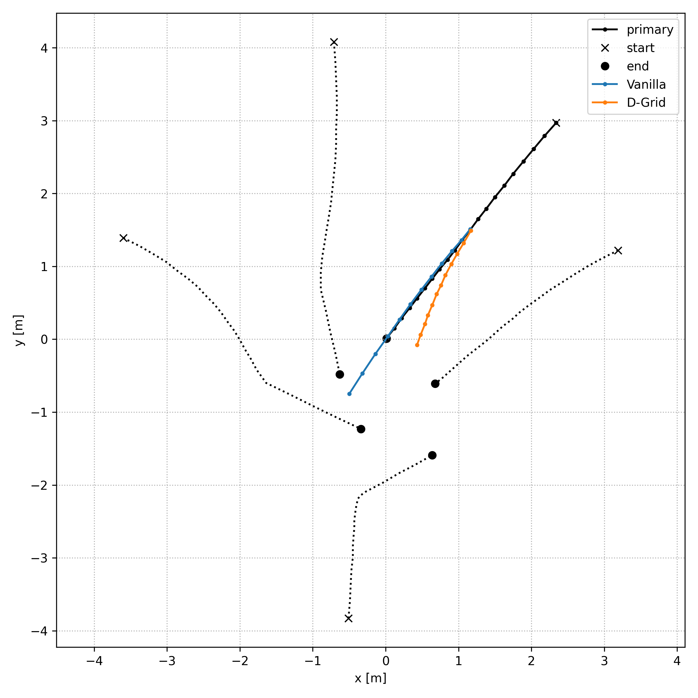

#TrajNet++ : The Trajectory Forecasting Framework

#### Course: CIVIL-459 Deep Learning for Autonomous Vehicles

#### Students: Maxime Gardoni, Anthony Guinchard, Robert Pieniuta

PyTorch implementation of [*Human Trajectory Forecasting in Crowds: A Deep Learning Perspective*](https://arxiv.org/pdf/2007.03639.pdf)

This project is conducted in the frame of the EPFL course *CIVIL-459 Deep Learning for Autonomous Vehicles*. It is forked from the original [TrajNet++ repository](https://github.com/vita-epfl/trajnetplusplusbaselines) by VITA lab.

TrajNet++ is a large scale interaction-centric trajectory forecasting benchmark comprising explicit agent-agent scenarios. The framework provides proper indexing of trajectories by defining a hierarchy of trajectory categorization. In addition, it provides an extensive evaluation system to test the gathered methods for a fair comparison. In the evaluation, the framework goes beyond the standard distance-based metrics and introduces novel metrics that measure the capability of a model to emulate pedestrian behavior in crowds. Finally, TrajNet++ provides code implementations of > 10 popular human trajectory forecasting baselines.

## Milestone 1: Getting Started
Visualizations of 3 test scenes qualitatively comparing outputs of the *vanilla* model and *D-Grid* model both trained during 2 epochs:

Qualitative evaluation:

