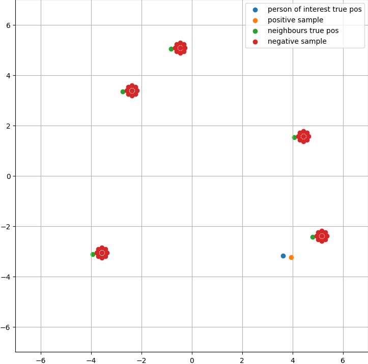

# TrajNet++ : The Trajectory Forecasting Framework


[](https://wakatime.com/badge/github/Antho1426/trajnetplusplusbaselines)
[](https://github.com/Naereen/badges/)


 **Course: CIVIL-459 Deep Learning for Autonomous Vehicles**

 > Teacher: Alexandre Alahi
 
 > Assistants: Parth Kothari, George Adaimi

 > Students: Maxime Gardoni, Anthony Guinchard, Robert Pieniuta

PyTorch implementation of the paper [*Human Trajectory Forecasting in Crowds: A Deep Learning Perspective*](https://arxiv.org/pdf/2007.03639.pdf).


This project is conducted in the frame of the EPFL course *CIVIL-459 Deep Learning for Autonomous Vehicles*. It is forked from the original [TrajNet++ repository](https://github.com/vita-epfl/trajnetplusplusbaselines) elaborated by VITA lab from EPFL.

TrajNet++ is a large scale interaction-centric trajectory forecasting benchmark comprising explicit agent-agent scenarios. The framework provides proper indexing of trajectories by defining a hierarchy of trajectory categorization. In addition, it provides an extensive evaluation system to test the gathered methods for a fair comparison. In the evaluation, the framework goes beyond the standard distance-based metrics and introduces novel metrics that measure the capability of a model to emulate pedestrian behavior in crowds. Finally, TrajNet++ provides code implementations of > 10 popular human trajectory forecasting baselines.

## Table of contents
1. [ Milestone 1: Getting Started ](#mi_1)

 1.1 [ 1) 1) Visualizations ](#mi_1_vis) 
 
 1.2 [ 2) Qualitative evaluation ](#mi_1_qual_eval)

2. [ Milestone 2: Implementing Social Contrastive Learning ](#mi_2)


<a name="mi_1"></a>
## ᐅ Milestone 1: Getting Started

The purpose of this first milestone is to get used to work with the TrajNet++ framework and its command line interface for training and evaluating models.

<a name="mi_1_vis"></a>
### 1) Visualizations

Visualizations of 3 test scenes qualitatively comparing outputs of the *Vanilla* model and *D-Grid* model both trained during 2 epochs:


Those 3 visualizations clearly demonstrate the superiority of the *D-Grid* model over the *Vanilla*  one in terms of both Average Displacement Error (ADE) and Final Displacement Error (FDE) already for only 2 epochs of training.

Command used to train the *Vanilla* model on 2 epochs:


```
python -m trajnetbaselines.lstm.trainer --epochs 2 --path five_parallel_synth_split --augment
```

Command used to train the *D-Grid* model on 2 epochs:

```
python -m trajnetbaselines.lstm.trainer --epoch 2 --path five_parallel_synth_split --type 'directional' --goals --augment
```

<a name="mi_1_qual_eval"></a>
### 2) Qualitative evaluation

Qualitative evaluation (Results.png):


<a name="mi_2"></a>
## ᐅ Milestone 2: Implementing Social Contrastive Learning

Based on our familiarity with the Trajnet++ framework, the purpose of this second milestone is to apply social contrastive learning to the D-LSTM (i.e. *D-Grid*) model. More information about this method can be found in the paper [*Social NCE: Contrastive Learning of Socially-aware Motion Representations*](https://arxiv.org/pdf/2012.11717.pdf) written by researchers from VITA lab of EPFL. Briefly explained, contrastive learning combined with negative data augmentation has been a promising technique to boost the robustness of forecasting models. In addition, it has been shown that using social contrastive learning helps to reduce the percentage of collision (COL). In fact, this strategy allows to locally treat trajectories to avoid other pedestrians (in comparison with a model that has been trained without contrastive loss). In this second milestone we have hence implemented contrastive learning and sampling methods (both positive and negative) as suggested in the [reference paper](https://arxiv.org/pdf/2012.11717.pdf).

Example of scene presenting both positive and negative samples used to train our model following the safety-driven sampling strategy proposed in the [reference paper](https://arxiv.org/pdf/2012.11717.pdf):




Here is our results comparison in terms of FDE and Col-I of your D-LSTM models trained without (milestone 1) and with (milestone 2) contrastive loss.


