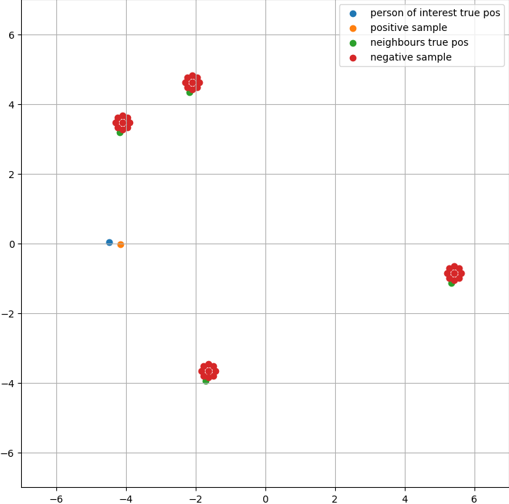

# TrajNet++ : The Trajectory Forecasting Framework


[](https://wakatime.com/badge/github/Antho1426/trajnetplusplusbaselines)
[](https://github.com/Naereen/badges/)


 **Course: CIVIL-459 Deep Learning for Autonomous Vehicles**

 > Teacher: Alexandre Alahi
 
 > Assistants: Parth Kothari, George Adaimi

 > Students: Maxime Gardoni, Anthony Guinchard, Robert Pieniuta

PyTorch implementation of the paper [*Human Trajectory Forecasting in Crowds: A Deep Learning Perspective*](https://arxiv.org/pdf/2007.03639.pdf).


This project is conducted in the frame of the EPFL course *CIVIL-459 Deep Learning for Autonomous Vehicles*. It is forked from the original [TrajNet++ repository](https://github.com/vita-epfl/trajnetplusplusbaselines) elaborated by VITA lab from EPFL.

TrajNet++ is a large scale interaction-centric trajectory forecasting benchmark comprising explicit agent-agent scenarios. The framework provides proper indexing of trajectories by defining a hierarchy of trajectory categorization. In addition, it provides an extensive evaluation system to test the gathered methods for a fair comparison. In the evaluation, the framework goes beyond the standard distance-based metrics and introduces novel metrics that measure the capability of a model to emulate pedestrian behavior in crowds. Finally, TrajNet++ provides code implementations of > 10 popular human trajectory forecasting baselines.

## Table of contents

1. [ Milestone 1: Getting Started ](#mi_1)

 &nbsp;&nbsp;&nbsp;&nbsp;&nbsp;&nbsp;1.1 [ Visualizations ](#mi_1_vis) 
 
 &nbsp;&nbsp;&nbsp;&nbsp;&nbsp;&nbsp;1.2 [ Qualitative evaluation ](#mi_1_qual_eval)

2. [ Milestone 2: Implementing Social Contrastive Learning ](#mi_2)

 &nbsp;&nbsp;&nbsp;&nbsp;&nbsp;&nbsp;2.1 [ Spatial sampling ](#mi_2_sp)
 
 &nbsp;&nbsp;&nbsp;&nbsp;&nbsp;&nbsp;2.2 [ Contrastive learning implementation ](#mi_2_cli)
 
 &nbsp;&nbsp;&nbsp;&nbsp;&nbsp;&nbsp;2.3 [ Training ](#mi_2_tr)
 
 &nbsp;&nbsp;&nbsp;&nbsp;&nbsp;&nbsp;2.4 [ Results ](#mi_2_res)
 
 &nbsp;&nbsp;&nbsp;&nbsp;&nbsp;&nbsp;2.5 [ Observations ](#mi_2_obs)
  

<a name="mi_1"></a>
## ᐅ Milestone 1: Getting Started

The purpose of this first milestone is to get used to work with the TrajNet++ framework and its command line interface for training and evaluating models.

<a name="mi_1_vis"></a>
### 1) Visualizations

Visualizations of 3 test scenes qualitatively comparing outputs of the *Vanilla* model and *D-Grid* model both trained during 2 epochs:


Those 3 visualizations clearly demonstrate the superiority of the *D-Grid* model over the *Vanilla*  one in terms of both Average Displacement Error (ADE) and Final Displacement Error (FDE) already for only 2 epochs of training.

Command used to train the *Vanilla* model on 2 epochs:


```
python -m trajnetbaselines.lstm.trainer --epochs 2 --path five_parallel_synth_split --augment
```

Command used to train the *D-Grid* model on 2 epochs:

```
python -m trajnetbaselines.lstm.trainer --epoch 2 --path five_parallel_synth_split --type 'directional' --goals --augment
```

<a name="mi_1_qual_eval"></a>
### 2) Qualitative evaluation

Qualitative evaluation (Results.png):


<a name="mi_2"></a>
## ᐅ Milestone 2: Implementing Social Contrastive Learning

Based on our familiarity with the Trajnet++ framework, the purpose of this second milestone is to apply social contrastive learning to the D-LSTM (i.e. *D-Grid*) model. More information about this method can be found in the paper [*Social NCE: Contrastive Learning of Socially-aware Motion Representations*](https://arxiv.org/pdf/2012.11717.pdf) written by researchers from VITA lab of EPFL. Briefly explained, contrastive learning combined with negative data augmentation has been a promising technique to boost the robustness of forecasting models. In addition, it has been shown that using social contrastive learning helps to reduce the percentage of collision (COL). In fact, this strategy allows to locally treat trajectories to avoid other pedestrians (in comparison with a model that has been trained without contrastive loss). In this second milestone we have hence implemented contrastive learning and sampling methods (both positive and negative) as suggested in the [reference paper](https://arxiv.org/pdf/2012.11717.pdf).

Given time constraints, it was chosen not to implement event sampling in order to better focus on the spatial sampling and its hyperparameters tuning.

<a name="mi_2_sp"></a>
### 1) Spatial sampling

Here is how our spatial sampling is performed:

* Positive sampling: the ground truth position of the primary pedestrian is selected, and a small noise is added in order to avoid overfitting.

* Negative sampling: the generation of negative samples was a bit more challenging, since the number of neighbours is not constant and can vary from scene to scene. Here are the three main points of our proposed solution:

	i. A constant maximum number of neighbours is defined, and a big tensor of negative samples is built based on this constant.

	ii. The first part of this tensor is filled with the present neighbour position, on which we add shifts in 9 different directions, and again a small noise to prevent overfitting.
	
	iii. The leftover part of this tensor is filled with NaN values (missing neighbours).

Example of scene with 4 neighbours presenting both positive and negative samples used to train our model following the safety-driven sampling strategy proposed in the [reference paper](https://arxiv.org/pdf/2012.11717.pdf):




<a name="mi_2_cli"></a>
### 2) Contrastive learning implementation

After sampling, the following steps were performed in our contrastive learning process:

1. Saving a mask for the present neighbours.
2. Conversion of NaN values to 0 to cancel their effect in the following MLP.
3. Lower-dimensional embedding of the past trajectories, negative samples and positive samples computation via an MLP encoder.
4. Normalization of those lower-dimensional embeddings.
5. Similarity computation between positive/negative embeddings and the predicted trajectory.
6. Using the mask, setting the similarity value for missing sample to -10 to prevent them from interfering with the loss computation.
7. Loss computation


<a name="mi_2_tr"></a>
### 3) Training

**Training procedure**

The models trained on both real (`real_data`) and synthetic (`synth_data`) data obtained from milestone 1 (25 epochs) were fine-tuned using this new NCE (Noise Contrastive Estimation) loss function designed for contrastive learning again on both real and synthetic data.

**Hyperparameters tuning**

The parameters to be tuned were the following:

* Contrastive weight (`contrastive_weight`): relative weight of the contrastive loss with respect to the original loss.
* Learning rate (`lr`) of the network: a too high learning rate might destroy the previously learned net; on the other hand, a too low learning rate might be ineffective to pursue learning.
* Number of additional epochs (`epochs`) used for fine-tuning.


<a name="mi_2_res"></a>
### 4) Results

Here is our results comparison in terms of FDE and Col-I of our D-LSTM models trained without (milestone 1) and with (milestone 2) contrastive loss.

**Milestone 1**

| Subm. | Epochs | lr       | FDE  | COL-I |
|-------|--------|----------|------|-------|
| 1     | 15     | 1.e-03   | 1.22 | 6.32  |
| 2     | 25     | 1.e-03   | 1.22 | 6.03  |


**Milestone 2**

| Subm. | Start epoch | Add. epochs | lr    | contrast_weight | FDE  | COL-I |
|-------|-------------|-------------|-------|-----------------|------|-------|
| 1     | 30          | 10          | 1e-04 | 2               | 1.22 | 6.03  |
| 2     | 30          | 10          | 1e-04 | 2 and 5         | 1.23 | 5.85  |
| 3     | 30          | 15          | 1e-02 | 1               | 1.34 | 7.16  |
| 4     | 30          | 10          | 1e-03 | 3               | 1.25 | <mark>5.25</mark>  |
| 5     | 30          | 15          | 1e-03 | 4               | 1.22 | 6.5   |
| 6     | 25          | 10          | 1e-03 | 5               | 1.23 | 5.61  |
| 7     | 30          | 10          | 5e-03 | 1               | 1.27 | 6.32  |
| 8     | 25          | 15          | 1e-03 | 2               | 1.23 | 5.85  |
| 9     | 25          | 15          | 5e-04 | 4               | <mark>1.21</mark> | 6.44  |
| 10    | 25          | 15          | 1e-03 | 2.5             | <span style="background-color:lightgreen">1.22</span> | <span style="background-color:lightgreen">5.55</span>  |


<a name="mi_2_obs"></a>
### 5) Observations

From the results we obtain, we can see that in comparison to our best submission for milestone 1 (submission 2) the contrastive loss managed to improve the COL-I measure (Prediction Collision) by at most 13% (submission 4 of milestone 2). This observation allows us to conclude that the contrastive learning and the negative data augmentation (i.e. creating negative samples around neighbours) implemented in this second milestone effectively help to reduce the amount of collisions and hence to predict more realistic pedestrian trajectories.

Concerning the FDE (Final Displacement Error), even if this metric didn't decrease that much in comparison with milestone 1 (our lowest FDE was obtained with submission 9), we can conclude that this new NCE loss remains all the same competitive in the FDE by not impacting it too much.

To sum up, the overall best performing model we trained (i.e. the one embedding jointly the lowest FDE and COL-I) is the one of submission 10. As said previously, the learning rate must be chosen wisely to allow the model to learn effectively. In our case, we have chosen to keep its default value (1e-3). In the first submissions we made, we started with a model that we had not submitted for milestone 1, but that we had trained to 30 epochs. Later, for fairer comparisons, we chose rather to fine-tune the best model we had submitted to AICrowd (i.e. the one from submission 2 of milestone 1 trained to 25 epochs) even though it has been trained on 5 less epochs. We also observed that there doesn't seem to be much improvement between 10 and 15 additional epochs. Indeed, the learning curve should apparently gently tend towards a zero slope from 10 additional epochs. Finally, the contrastive weight (introduced in milestone 2) was the new critical hyperparameter we had to tune. From our tests, we deduce that an optimal value for this parameter is situated between 2 and 4 in order to influence the global loss in a reasonable way and to reduce the COL-I metric.
