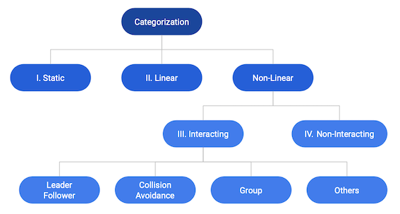
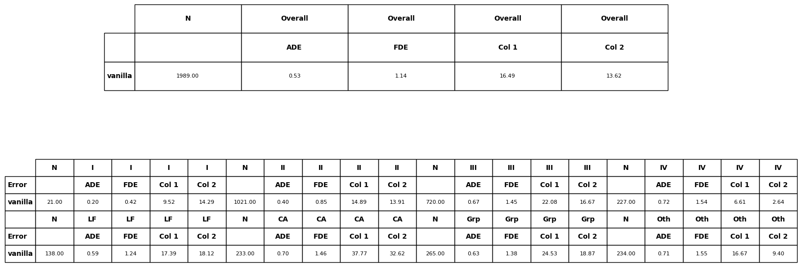

Venv Setup (Temporary: For VITA)
================================

Create a common virtual environment.

Go to Trajnettools.

``python3 setup.py sdist bdist_wheel``

``pip install .``

Data Setup
==========

Data Conversion
---------------

For data conversion, refer to Trajnetdataset.

Data Directory Setup
--------------------

All the converted datasets are stored in DATA_BLOCK

Directory structure of DATA_BLOCK:

- Dataset1 (default: trajdata)

   - train
   - val
   - test
   - test_private

- Dataset2

   - train
   - val
   - test
   - test_private

Move the converted dataset for training to DATA_BLOCK:

``mkdir -p DATA_BLOCK/trajdata``

``cp -r <converted_dataset>/ DATA_BLOCK/trajdata``

The models after training are stored in OUTPUT_BLOCK:

``mkdir OUTPUT_BLOCK``

Training LSTMs
==============

The training script and its help menu:
``python -m trajnetbaselines.lstm.trainer --help``

Evaluation
==========

Evaluation on datasplits is based on the following categorization:

The evaluation script and its help menu: ``python -m evaluator.trajnet_evaluator --help``

