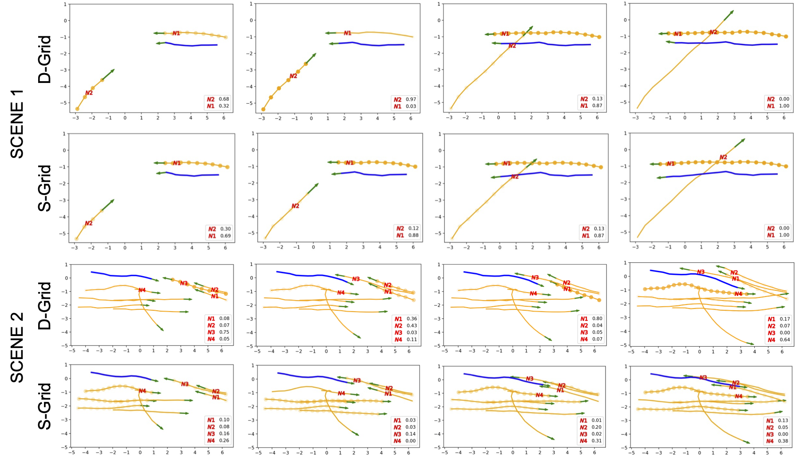

Explaining Trajectory Forecasting Models: Layer-wise Relevance Propagation
=========================================================================

Visualizing the decision-making of grid-based interaction modules using layer-wise relevance propagation. The darker the yellow circles, the more is the weight (also shown in the legend) provided by the primary pedestrian (blue) to the corresponding neighbour (yellow). Our proposed D-Grid, driven by domain knowledge, outputs more human-like trajectories with more intuitive focus on surrounding neighbours as compared to S-Grid.

Curently, the implementation supports LRP visualization for grid-based interaction modules, and can easily be extended to non-grid-based modules. 

Dependencies
============

1. Celluloid

Running LRP
===========

Once an LSTM model is trained, use the following script for visualizing LRP:

``python -m evaluator.fast_evaluator --path <dataset_name> --output <model_pkl_file>``

Animations are saved in the *anims* folder

The script for generating the below animation:

``python -m evaluator.fast_evaluator --path crowds_zara02 --output lstm_directional_one_12_6.pkl``

.. image:: docs/train/LRP.gif

Citation
========

If you find this code useful in your research then please cite

.. code-block::

    @inproceedings{Kothari2020HumanTF,
      title={Human Trajectory Forecasting in Crowds: A Deep Learning Perspective},
      author={Parth Kothari and Sven Kreiss and Alexandre Alahi},
      year={2020}
    }

Acknowledgements
================

Our LRP code is inspired from `LRP for LSTM <https://github.com/ArrasL/LRP_for_LSTM>`_
