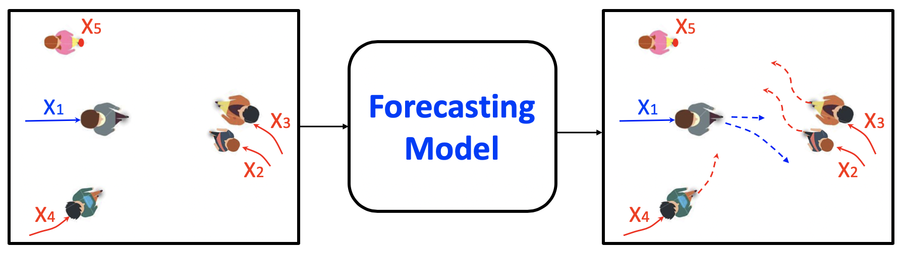
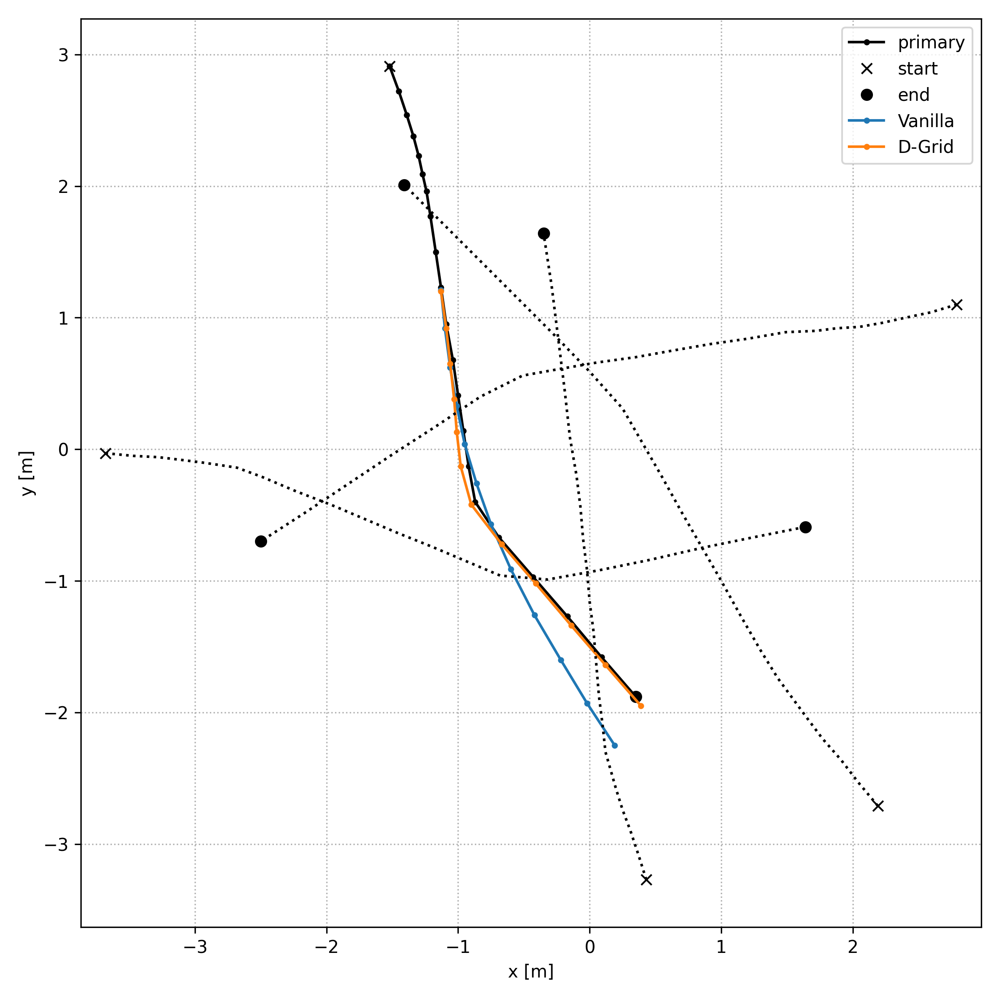
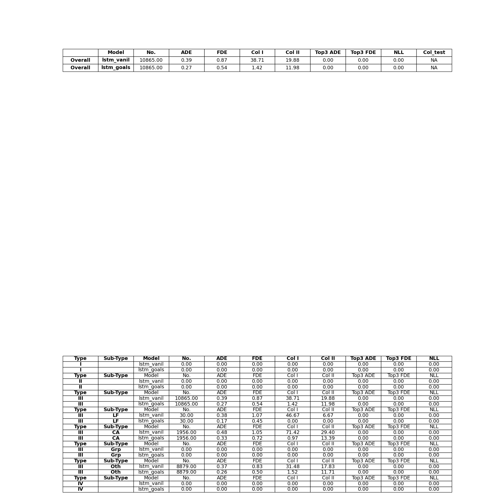

TrajNet++ : The Trajectory Forecasting Framework
================================================

 **Course: CIVIL-459 Deep Learning for Autonomous Vehicles**

 Teacher: Alexandre Alahi

 Assistants: Parth Kothari, George Adaimi

 Students: Maxime Gardoni, Anthony Guinchard, Robert Pieniuta

PyTorch implementation of `Human Trajectory Forecasting in Crowds: A Deep Learning Perspective <https://arxiv.org/pdf/2007.03639.pdf>`_.

This project is conducted in the frame of the EPFL course *CIVIL-459 Deep Learning for Autonomous Vehicles*. It is forked from the original `TrajNet++ repository <https://github.com/vita-epfl/trajnetplusplusbaselines>`_ elaborated by VITA lab.

TrajNet++ is a large scale interaction-centric trajectory forecasting benchmark comprising explicit agent-agent scenarios. The framework provides proper indexing of trajectories by defining a hierarchy of trajectory categorization. In addition, it provides an extensive evaluation system to test the gathered methods for a fair comparison. In the evaluation, the framework goes beyond the standard distance-based metrics and introduces novel metrics that measure the capability of a model to emulate pedestrian behavior in crowds. Finally, TrajNet++ provides code implementations of > 10 popular human trajectory forecasting baselines.

Milestone 1: Getting Started
----------------------------
The purpose of this first milestone is to get used to work with the TrajNet++ framework and its command line interface for training and evaluating models.

1) Visualizations
~~~~~~~~~~~~~~~~~
Visualizations of 3 test scenes qualitatively comparing outputs of the *Vanilla* model and *D-Grid* model both trained during 2 epochs:

.. image:: milestone_1_predictions_vanilla_d-grid/visualize.scene44949.png
   :height: 500px
   :width: 500 px
   :scale: 100 %
   :alt: visualize.scene46482.png
   :align: left

.. image:: milestone_1_predictions_vanilla_d-grid/visualize.scene47642.png
   :height: 500px
   :width: 500 px
   :scale: 100 %
   :alt: visualize.scene46482.png
   :align: left

Those 3 visualizations clearly demonstrate the superiority of the *D-Grid* model over the *Vanilla*  one in terms of both Average Displacement Error (ADE) and Final Displacement Error (FDE) already for 2 epochs of training.

Command used to train the *Vanilla* model on 2 epochs:

.. code-block::

    python -m trajnetbaselines.lstm.trainer --epochs 2 --path five_parallel_synth_split --augment

Command used to train the *D-Grid* model on 2 epochs:

.. code-block::

	python -m trajnetbaselines.lstm.trainer --epoch 2 --path five_parallel_synth_split --type 'directional' --goals --augment

2) Qualitative evaluation
~~~~~~~~~~~~~~~~~~~~~~~~~

Qualitative evaluation (Results.png):

