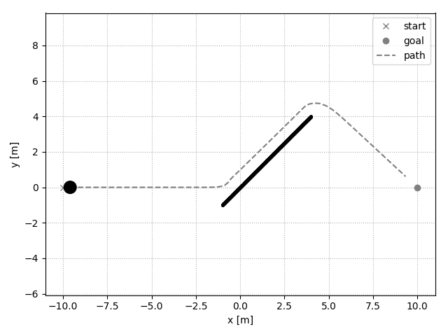
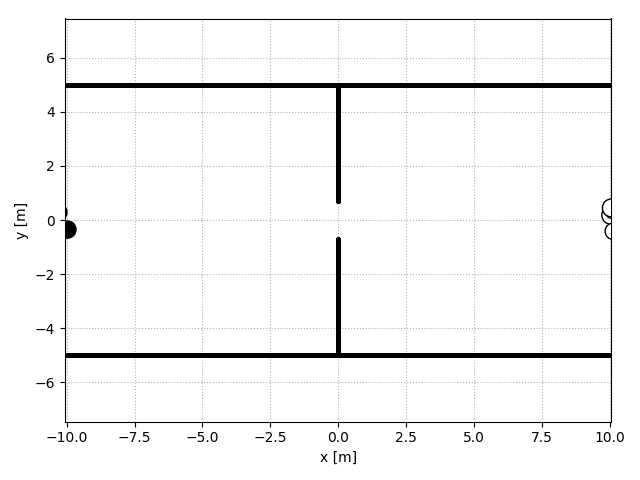

[](https://github.com/svenkreiss/socialforce/actions/workflows/tests.yml)<br />
[Executable Book documentation](https://www.svenkreiss.com/socialforce/).<br />
[Deep Social Force (arXiv:2109.12081)](https://arxiv.org/abs/2109.12081).

# Deep Social Force

> [__Deep Social Force__](https://arxiv.org/abs/2109.12081)<br />
> _[Sven Kreiss](https://www.svenkreiss.com)_, 2021.
>
> The Social Force model introduced by Helbing and Molnar in 1995
> is a cornerstone of pedestrian simulation. This paper
> introduces a differentiable simulation of the Social Force model
> where the assumptions on the shapes of interaction potentials are relaxed
> with the use of universal function approximators in the form of neural
> networks.
> Classical force-based pedestrian simulations suffer from unnatural
> locking behavior on head-on collision paths. In addition, they cannot
> model the bias
> of pedestrians to avoid each other on the right or left depending on
> the geographic region.
> My experiments with more general interaction potentials show that
> potentials with a sharp tip in the front avoid
> locking. In addition, asymmetric interaction potentials lead to a left or right
> bias when pedestrians avoid each other.


# Install and Run

```sh
# install from PyPI
pip install 'socialforce[dev,plot]'

# or install from source
pip install -e '.[dev,plot]'

# run linting and tests
pylint socialforce
pycodestyle socialforce
pytest tests/*.py
```


# Ped-Ped-Space Scenarios




Emergent lane forming behavior with 30 and 60 pedestrians:


# Download TrajNet++ Data

The [Executable Book](https://www.svenkreiss.com/socialforce/)
requires some real-world data for the TrajNet++ section.
This is how to download and unzip it to the right folder:

```
wget -q https://github.com/vita-epfl/trajnetplusplusdata/releases/download/v4.0/train.zip
mkdir data-trajnet
unzip train.zip -d data-trajnet
```